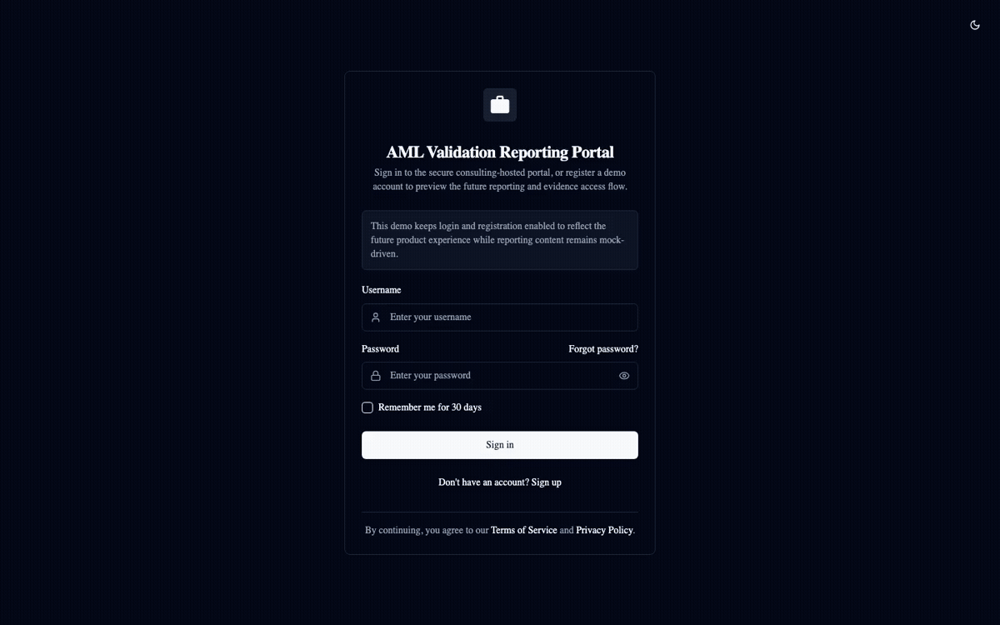

# AML Model Validation Reporting Portal Demo

[](https://nextjs.org/)
[](https://react.dev/)
[](https://www.typescriptlang.org/)
[](https://www.prisma.io/)
[](https://www.postgresql.org/)
[](https://tailwindcss.com/)
[](https://www.radix-ui.com/)
[](https://www.docker.com/)

## Overview

This repository contains a consulting-quality stakeholder demo for an **AML Model Validation Reporting Portal**.

The current demo is intentionally positioned as a **secure reporting and evidence portal**, not as a platform that executes AML validation workflows inside the consulting environment.

That distinction matters.

In real financial-institution settings, validation data, model inputs, case evidence, and supporting datasets often **cannot be moved out of the institution**. Because of that constraint, this portal is designed to represent a consulting-hosted environment that focuses on:

- secure access to validation reporting
- evidence review
- findings and remediation tracking
- audit-ready reporting
- portfolio-level visibility across engagements
- reporting for both traditional AML model validation and GenAI-assisted AML workflow validation

Validation execution itself remains inside the financial institution.

## Current Demo Status

- **Current status:** consulting-practice reporting portal / phase-1 demo
- **Original version:** 2025
- **Refreshed:** 2026
- **Framework:** Next.js App Router + TypeScript
- **Database:** PostgreSQL via Prisma
- **Access model in this phase:** login/register enabled for secure portal access
- **Validation tracks in scope:**
  - Traditional AML model validation reporting
  - GenAI-assisted AML workflow validation reporting

## Why This Demo Exists

This demo is meant to help consulting leadership, practice leads, client-facing teams, and sponsors evaluate a larger product/application opportunity.

It shows how a consulting firm could provide a **secure reporting environment** for AML model validation work where:

- client data and validation execution remain inside the bank or financial institution
- the consulting-hosted portal focuses on reporting, evidence, governance visibility, and stakeholder communication
- both traditional AML validation and GenAI assurance can be presented through one shared reporting experience
- different stakeholder groups can see role-relevant reporting views without needing separate products

## 2026 Refresh Highlights

This repository was originally created in **2025** and has been updated for **2026**.

Recent improvements include:

- library and dependency updates for a more current 2026 baseline
- Docker-based local setup for both the web application and the database
- reporting-focused repositioning of the portal
- persona-aware reporting views for consulting and client stakeholders
- support for both traditional AML validation reporting and GenAI-assisted AML workflow validation reporting
- secure login/register flow to reflect controlled access to a consulting-hosted reporting portal

See [Upgrade Notes 2026](./UPGRADE_NOTES_2026.md) for a dedicated summary of the refresh.

## Security And Hosting Model

This demo should be understood as a **consulting-hosted reporting portal**.

The intended operating model is:

- validation workflows execute inside the financial institution
- institution data remains inside the institution boundary
- validation outputs, approved reporting artifacts, findings summaries, and evidence references are surfaced in the consulting environment
- portal access is controlled through authentication because reporting content is sensitive and intended for approved consulting and client stakeholders only

The login/register flow exists to reinforce that secure-access model.

## What The Demo Shows

The demo emphasizes:

- secure reporting access for consulting and client stakeholders
- reporting visibility across multiple client engagements
- a shared validation inventory covering both traditional AML models and GenAI workflows
- report-ready views of findings, evidence, testing outcomes, and remediation
- persona-aware reporting emphasis rather than execution-oriented workflow tooling
- a clear path from reporting portal demo to larger product/platform investment

## What The Demo Does Not Yet Do

This phase is not a full production system and does not attempt to execute validation workflows inside the consulting environment.

It does not yet provide:

- full RBAC enforcement
- production report ingestion pipelines
- production document management
- institution-side workflow execution controls

Instead, it demonstrates how reporting and governance outputs could be surfaced securely.

## Supported Demo Content

The current synthetic data set includes:

- 4 client engagements
- traditional AML validation reporting across:
  - transaction monitoring
  - customer risk
  - sanctions screening / watchlist
- 4 GenAI workflow validation reporting items:
  - `GAI-001 Alert Narrative Assistant`
  - `GAI-002 AML Case Summarization Assistant`
  - `GAI-003 AML Policy Copilot`
  - `GAI-004 Disposition Recommendation Assistant`
- traditional-model reporting concepts such as:
  - precision
  - recall
  - ROC-AUC
  - false positive rate
  - scenario test summaries
  - findings and remediation items
- GenAI workflow reporting concepts such as:
  - grounding coverage
  - citation quality
  - hallucination risk
  - policy-adherence issues
  - human-review requirements
  - prompt/control test outcomes

## Shared Route Structure

The dual-track reporting portal uses one shared route structure for both traditional AML-model reporting and GenAI-workflow reporting:

- `/dashboard`
- `/models`
- `/models/[modelId]`
- `/testing`
- `/findings`
- `/reports/[modelId]`

There is no separate GenAI product area or `/ai-workflows` route.

## Recommended First Demo Path

1. Open `/register` and create a demo user if needed.
2. Sign in through `/login`.
3. Land on `/dashboard`.
4. Use the **Client Selector** and **Persona Switcher**.
5. Show how reporting emphasis changes by persona.
6. Move to `/models` and show the shared validation inventory.
7. Open one traditional reporting item and one GenAI reporting item.
8. Walk through `/testing`, `/findings`, and `/reports/[modelId]` as reporting and evidence surfaces.

## Demo Video

The repository includes a short walkthrough asset that matches the current reporting-portal story:

- [](./public/demo/demo-walkthrough.mp4)

Download or open the short demo video here:

- [public/demo/demo-walkthrough.mp4](./public/demo/demo-walkthrough.mp4)

Regeneration support lives in:

- [docs/demo-video/VIDEO_REFRESH_PLAN.md](./docs/demo-video/VIDEO_REFRESH_PLAN.md)
- [docs/demo-video/SHOT_LIST.md](./docs/demo-video/SHOT_LIST.md)
- [docs/demo-video/NARRATION.md](./docs/demo-video/NARRATION.md)
- [scripts/generate-demo-video.mjs](./scripts/generate-demo-video.mjs)

## Personas In This Portal

The reporting portal is aligned to consulting-practice and client-consumer roles rather than workflow-execution roles inside the institution.

Current personas:

- Consulting Partner
- Engagement Lead
- Validation Lead
- Client Compliance Sponsor
- Client Model Sponsor
- Platform Admin

Persona switching changes:

- KPI order
- widget emphasis
- CTA labels
- activity feed emphasis
- insight banner text
- reporting highlights for traditional and GenAI tracks

## Demo Narrative

The recommended reporting narrative is:

1. **Executive Dashboard**  
   Show portfolio-level reporting status across traditional AML validation and GenAI validation.

2. **Validation Inventory**  
   Show the consulting firm’s shared inventory of validation reporting items across clients.

3. **Validation Detail / Reporting Workspace**  
   Show how one detail route supports both traditional-model reporting and GenAI-specific reporting sections.

4. **Testing Summary View**  
   Show traditional scenario summaries and GenAI prompt/control test summaries as reporting outputs.

5. **Findings & Remediation**  
   Show how material findings across both tracks are reviewed and prioritized.

6. **Report Preview / Audit Pack**  
   Show how the portal presents audit-ready and committee-ready reporting outputs.

## Install And Run The Demo

Two run modes are supported.

### Option 1: Docker Compose

This is the recommended setup because it starts both:

- the Next.js web app
- the PostgreSQL database

From the repository root:

```bash
docker compose up --build
```

Default endpoints:

- Web app: `http://localhost:3000`
- Postgres: `localhost:5433`

Optional port overrides:

```bash
WEB_PORT=3001 POSTGRES_PORT=5434 docker compose up --build
```

### Option 2: Local npm Run

#### Prerequisites

- Node.js 20+
- npm
- PostgreSQL running locally or remotely
- a `.env` file with at least:
  - `DATABASE_URL`
  - `JWT_SECRET`

#### Commands

```bash
npm install
npx prisma generate
npx prisma db push
npm run dev
```

Then open:

- `http://localhost:3000/login`
- or `http://localhost:3000/register`

### Production-Style Verification

```bash
npm run build
npm run start
```

## Demo Login Flow

This demo keeps **login and registration enabled** because the portal is positioned as a **secure consulting-hosted reporting environment**.

Important distinction:

- authentication and Prisma-backed user creation are real
- portal reporting surfaces are still primarily mock-data driven in this phase

## Intended Audience

This demo is intended for:

- consulting leadership
- AML practice leads
- engagement managers
- validation leads
- compliance stakeholders
- client sponsors and decision-makers
- internal product sponsors

## License

Licensed under the [MIT License](./LICENSE).

Copyright (c) 2026 Piyush Daiya

## Related Documents

- [Persona Demo Guide](./PERSONAS_DEMO_GUIDE.md)
- [Demo Walkthrough](./DEMO_WALKTHROUGH.md)
- [Upgrade Notes 2026](./UPGRADE_NOTES_2026.md)
